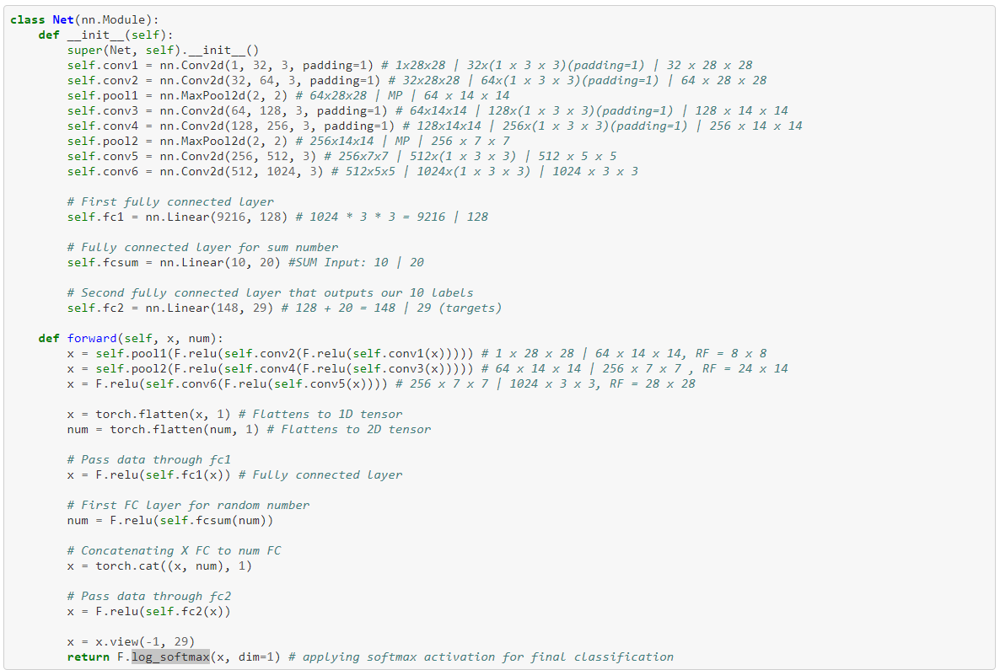
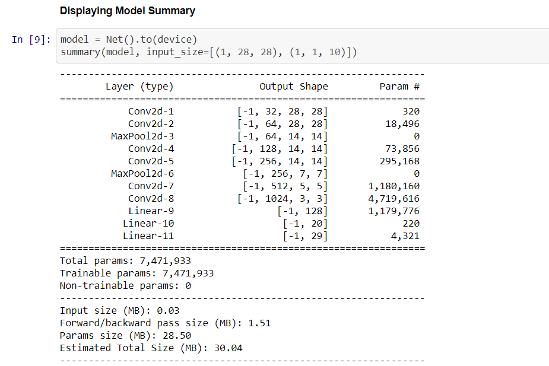
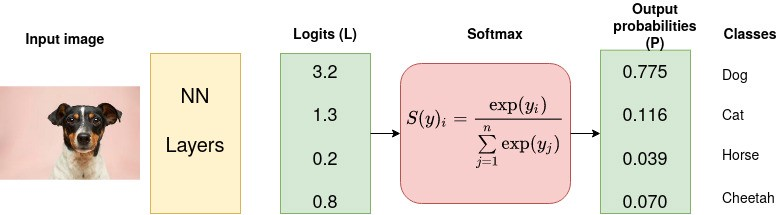
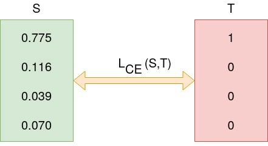

# Problem Statement


- Write a neural network that can;
  - Takes 2 inputs:
    - An image from the MNIST dataset (say 5),
    - A random number between 0 and 9, (say 7)
  - Gives two outputs:
    - The "number" that was represented by the MNIST image (predict 5)
    - The "sum" of this number with the random number and the input image to the network (predict 5 + 7 = 12)

# Solution:
## Data Preparation:
Since we have two input values for the model one is MNIST image and another is a random number so we have to prepare our own dataset which can provide these two values to our model input. Also, our output for the model is again 2, first to provide prediction for MNIST and second to provide prediction for SUM. So, our custom dataset should return three values:
- MNIST images
- random number
- target(This will be concatenation output of image prediction and SUM prediction)

Steps for generating dataset:
- First, get the MNIST image as input to our dataset
- Generate random number of size same as MNIST dataset length.
- Generate one hot encoding for the random number which can sent to the model directly as input.
- Calculate, sum of random number and MNIST target
- Create a separate target tensor where the shape will be (len(MNIST images), 2), So if we sending 100 images for training then it will be (100, 2), the first value will be target for MNIST prediction and the second value will be the target for SUM. The output will have 29 classes, first 10 to predict MNIST number(0-9) and next 19 is to predict sum(0-18).

Finally return the values by getitem method as (MNIST Image, random number input, concatenated sum)

## Model 

- As shown in the model summary the input image passes through the model first until it reaches a receptive field same as size of the image.
- Then we perform reshape to convert 3D tensor into 2D.

Assignment Google Colab Notebook: https://github.com/roulupen-mldl/EVA7/blob/main/IntroToPytorch_Session2_5/Session_2_5_PyTorch_101.ipynb 
- Then we send to a fully connected layer for identifying relationship between different parts of images.
- For the random number input, we pass it through a fully connected layer.
- Next we concat the result of image fully conncted layer to random number fully conncted layer and in next step we pass the concatenated tensor into final fully conncted layer and make sure it returns same number of result as the number of actual classes.
- Then we pass the result to log_softmax for final prediction.

### Final Model Summary


## Model Training

### Training on GPU:
To train the model on GPU we must send the data to GPU, so we have used below lines to send our tensor in GPU.
```
# Sending the tensors to the GPU/CPU
data, input_num, target = data.to(device), input_num.to(device), target.to(target)
```
**Training on GPU is much more faster than CPU.**

### Loss Function:
Our problem is a pure classification problem, first we are classifying digit then we are classifying digit sum.

In case of classification problem our final log_softmax activation function provides a probability score for each class as shown in below example:


But, the cross entropy function takes the probability scores and measures the distance from truth values as shown below:


So, that's the reason for choosing cross entropy loss function over other loss functions.

### Result Evaluation:
Apart from loss function(hich measures the model performance), there is a function called **get_num_correct** which takes the prediction and actual result and finds out how many are correct. 
```
# Find out number of correct predictions and number of wrong prediction
def get_num_correct(preds, labels):
   return preds.argmax(dim=1).eq(labels).sum().item()
```
In our example we are evaluating and model training on same data set but ideally for model evaluation we should have used a test data for better evaluation result.

