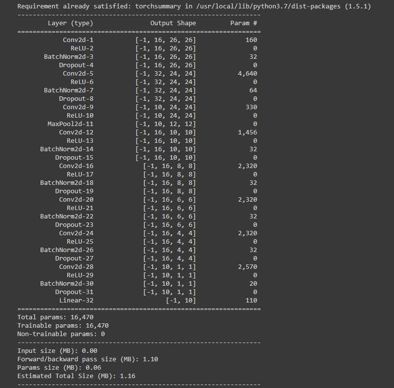

# Assignment:

## PART-1(Rewrite the whole excel sheet showing backpropagation):

## PART-2(CNN Model for MNIST digit classifier):

**Model Architecture**:

**Model Summary**:

**Model Training Log:**
loss=0.18191516399383545 LR: 0.010000000000000002 batch_id=468: 100%|██████████| 469/469 [00:27<00:00, 17.22it/s]

Epoch:1 Test set: Average loss: 0.0005, Accuracy: 9805/10000 (98.05%)

loss=0.047370944172143936 LR: 0.007581501140000001 batch_id=468: 100%|██████████| 469/469 [00:27<00:00, 17.03it/s]

Epoch:2 Test set: Average loss: 0.0004, Accuracy: 9827/10000 (98.27%)

loss=0.07604532688856125 LR: 0.00610500611 batch_id=468: 100%|██████████| 469/469 [00:27<00:00, 17.20it/s]

Epoch:3 Test set: Average loss: 0.0004, Accuracy: 9864/10000 (98.64%)

loss=0.0994354709982872 LR: 0.0051098620300000005 batch_id=468: 100%|██████████| 469/469 [00:27<00:00, 17.14it/s]

Epoch:4 Test set: Average loss: 0.0003, Accuracy: 9888/10000 (98.88%)

loss=0.08652856200933456 LR: 0.00439367311 batch_id=468: 100%|██████████| 469/469 [00:27<00:00, 17.18it/s]

Epoch:5 Test set: Average loss: 0.0002, Accuracy: 9918/10000 (99.18%)

loss=0.13949690759181976 LR: 0.0038535645500000003 batch_id=468: 100%|██████████| 469/469 [00:27<00:00, 17.03it/s]

Epoch:6 Test set: Average loss: 0.0002, Accuracy: 9891/10000 (98.91%)

loss=0.05737486481666565 LR: 0.0034317089900000003 batch_id=468: 100%|██████████| 469/469 [00:27<00:00, 17.04it/s]

Epoch:7 Test set: Average loss: 0.0002, Accuracy: 9913/10000 (99.13%)

loss=0.06265316158533096 LR: 0.00309310238 batch_id=468: 100%|██████████| 469/469 [00:27<00:00, 16.91it/s]

Epoch:8 Test set: Average loss: 0.0003, Accuracy: 9900/10000 (99.00%)

loss=0.05782516673207283 LR: 0.00281531532 batch_id=468: 100%|██████████| 469/469 [00:27<00:00, 17.01it/s]

Epoch:9 Test set: Average loss: 0.0002, Accuracy: 9917/10000 (99.17%)

loss=0.1332884281873703 LR: 0.0025833118100000003 batch_id=468: 100%|██████████| 469/469 [00:27<00:00, 17.09it/s]

Epoch:10 Test set: Average loss: 0.0002, Accuracy: 9916/10000 (99.16%)

loss=0.04740471765398979 LR: 0.0023866348400000004 batch_id=468: 100%|██████████| 469/469 [00:27<00:00, 17.13it/s]

Epoch:11 Test set: Average loss: 0.0002, Accuracy: 9925/10000 (99.25%)

loss=0.09961902350187302 LR: 0.0022177866500000002 batch_id=468: 100%|██████████| 469/469 [00:27<00:00, 17.08it/s]

Epoch:12 Test set: Average loss: 0.0002, Accuracy: 9922/10000 (99.22%)

loss=0.038910821080207825 LR: 0.00207125104 batch_id=468: 100%|██████████| 469/469 [00:27<00:00, 16.99it/s]

Epoch:13 Test set: Average loss: 0.0002, Accuracy: 9920/10000 (99.20%)

loss=0.06961670517921448 LR: 0.0019428793500000001 batch_id=468: 100%|██████████| 469/469 [00:27<00:00, 17.15it/s]

Epoch:14 Test set: Average loss: 0.0002, Accuracy: 9928/10000 (99.28%)

loss=0.06126169487833977 LR: 0.0018294914 batch_id=468: 100%|██████████| 469/469 [00:27<00:00, 17.08it/s]

Epoch:15 Test set: Average loss: 0.0002, Accuracy: 9930/10000 (99.30%)

loss=0.0913342833518982 LR: 0.00172860847 batch_id=468: 100%|██████████| 469/469 [00:27<00:00, 17.18it/s]

Epoch:16 Test set: Average loss: 0.0002, Accuracy: 9920/10000 (99.20%)

loss=0.014996021054685116 LR: 0.0016382699899999999 batch_id=468: 100%|██████████| 469/469 [00:27<00:00, 17.18it/s]

Epoch:17 Test set: Average loss: 0.0002, Accuracy: 9928/10000 (99.28%)

loss=0.05374161899089813 LR: 0.00155690487 batch_id=468: 100%|██████████| 469/469 [00:27<00:00, 16.93it/s]

Epoch:18 Test set: Average loss: 0.0002, Accuracy: 9938/10000 (99.38%)

loss=0.040314529091119766 LR: 0.00148323939 batch_id=468: 100%|██████████| 469/469 [00:27<00:00, 17.04it/s]

Epoch:19 Test set: Average loss: 0.0002, Accuracy: 9941/10000 (99.41%)

loss=0.022165248170495033 LR: 0.00141623 batch_id=468: 100%|██████████| 469/469 [00:27<00:00, 16.89it/s]

Epoch:20 Test set: Average loss: 0.0002, Accuracy: 9938/10000 (99.38%)

**The best validation accuracy is : 99.41%**
